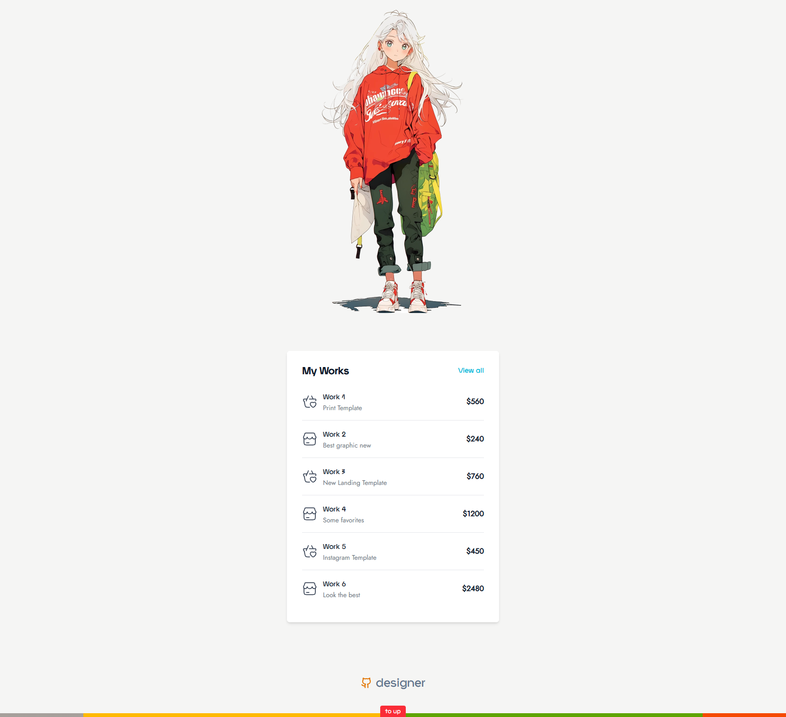

### [Mocato](https://mocato.vercel.app/) - Tailwind v4 Template

- Tailwind CSS v4
- Simple use Tailwind via CLI
- HTML5, CSS3
- Inline SVG icons 
- Local Google Fonts
- Radio player via Vanilla JS
- Fully responsive layout

```
Tailwind CSS v4 

Don't need tailwind.config anymore.
Just use > @import "tailwindcss"; < in your .css
```

Use Tailwind via CLI

- in project folder run in terminal > npm install tailwindcss @tailwindcss/cli  
- insert > @import "tailwindcss"; < in input.css  
- run in terminal > npx @tailwindcss/cli -i ./css/input.css -o ./css/style.css --watch
- That`s all. All your changes will be in style.css.
